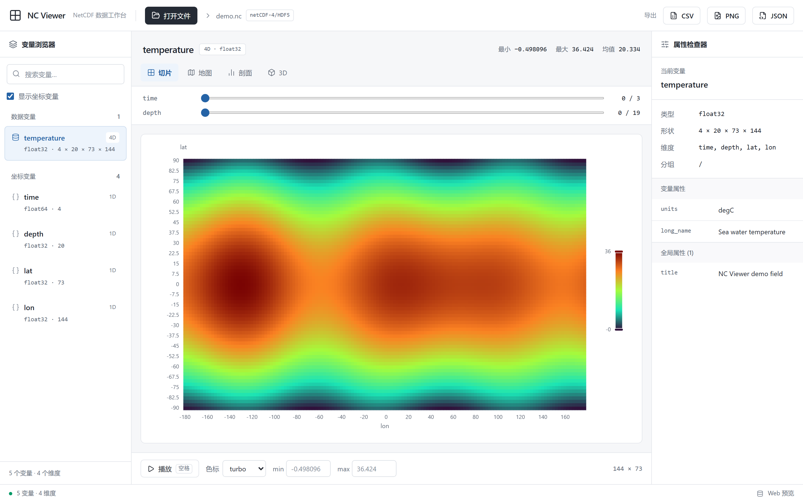
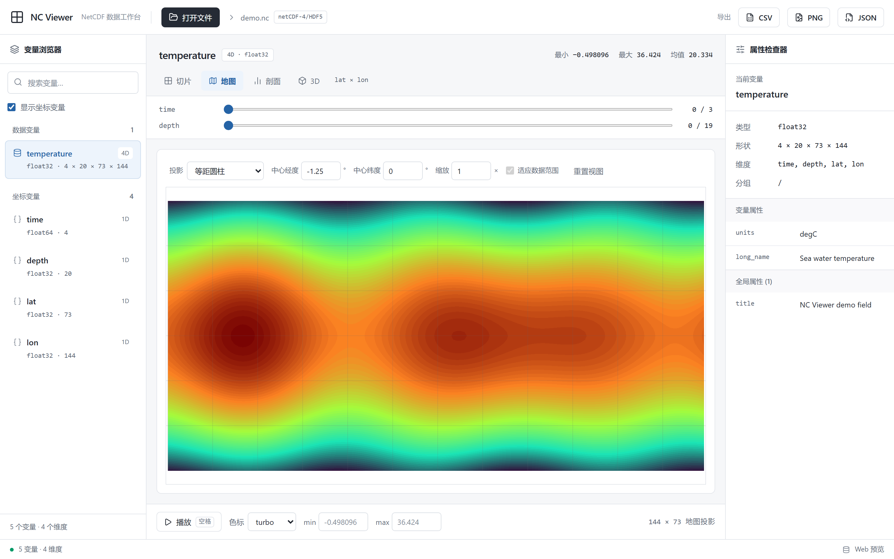
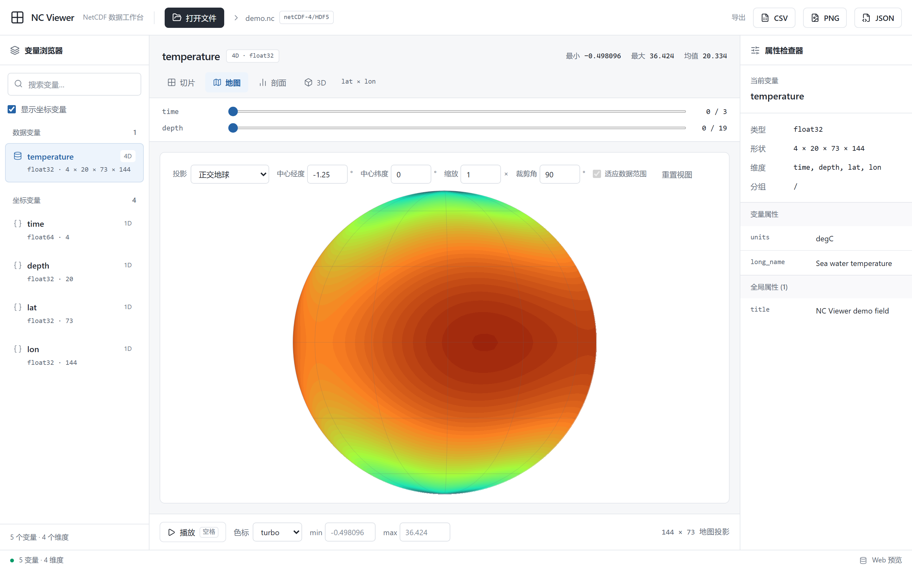
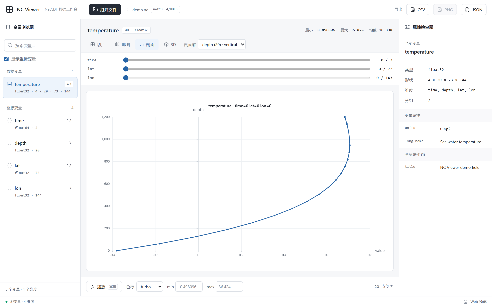
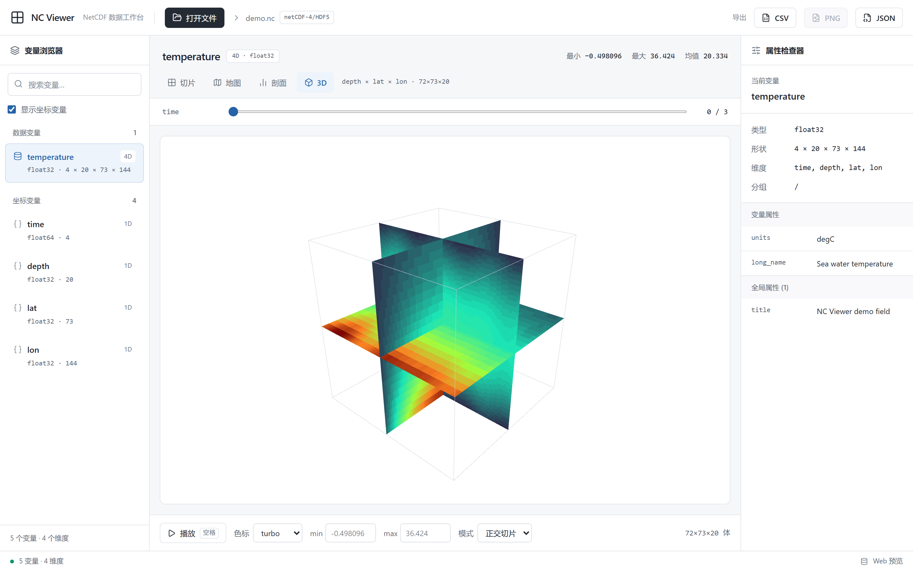

# NC Viewer

A modern NetCDF file viewer. Tauri 2 desktop shell with a React + TypeScript frontend, no native build dependencies.

[简体中文](README.zh.md) | **English**



## Features

- **Browse**: variable tree with search, dimension badges, attribute inspector (variable/global attributes), status bar
- **Slices**: 2D heatmap (ECharts), 10 colormaps, custom min/max, dimension sliders, time animation (press Space)
- **Map**: automatic lon/lat detection, 14 projections in three families (cylindrical/pseudocylindrical, azimuthal, conic), Canvas bilinear resampling with a projection-clipped graticule; adjustable center lon/lat, zoom, clip angle and standard parallels, one-click fit to the data extent (polar data auto-selects an azimuthal projection), probe clipped to the projection domain
- **Profile**: automatic vertical-axis detection (depth/height/pressure), 1D curve with a fixed-point label
- **3D**: Three.js orthogonal slices / isosurface (marching cubes), orbit controls
- **Probe**: hover to read values (slice/map)
- **Export**: CSV slice/profile, PNG heatmap, metadata JSON
- **UI language**: one-click 中文 / English switch, remembered across sessions

### Map projections

14 projections spanning the cylindrical/pseudocylindrical, azimuthal and conic families.
Center lon/lat, zoom, clip angle and standard parallels are all adjustable, with one-click
fit to the data extent; polar data automatically picks a suitable azimuthal projection.

| Equirectangular | Orthographic |
| --- | --- |
|  |  |

### Profile and 3D

| Vertical profile | 3D volume |
| --- | --- |
|  |  |

## Interface design

A clean, light data workbench: off-white background, hairline dividers, charcoal primary
buttons and a restrained blue for selection. Browse variables on the left, see the title,
statistics and visualization in the middle, and inspect attributes on the right; the empty
state offers a file picker and dropping a file shows a clear overlay.

Chart axes, map graticules, profile curves and 3D isosurfaces all match the light UI. The
heatmap defaults to the blue-yellow `cividis` colormap, with all scientific colormaps still
selectable. The 3D camera adapts to the volume size and viewport aspect ratio. Controls keep
keyboard focus rings; on narrow windows the toolbar wraps, the sidebars shrink, and below
800px the right inspector is hidden.

## Format support

- NetCDF-3 (parsed with netcdfjs)
- NetCDF-4 / HDF5 (parsed with h5wasm; dimension scales, internal attributes filtered)

## Development

```sh
npm install
npm run dev        # web preview at http://localhost:5173
npm run build      # frontend build
npx tauri dev      # desktop dev
npx tauri build    # bundle (MSI/NSIS, ~3-5MB)
```

## Unit tests

Pure functions (colormaps, geo-role detection, downsampling, projection math, i18n) are
covered by assertions that need no browser:

```sh
npm run test         # vitest over src/**/*.test.ts
npm run test:watch   # watch mode
```

## Performance benchmarks

Measure the hot paths from the command line, no UI required:

```sh
npm run bench          # frontend: parse / slice / profile / volume / downsample / colormap (vitest, plain Node)
npm run bench:backend  # backend: nc_meta / nc_slice_2d / nc_profile / nc_volume (release build)
```

Both report the median / min / max time per call. The backend large-file cases take a large
NetCDF file from the `NC_BENCH_BIG` environment variable; they skip automatically when it is
unset or missing:

```sh
$env:NC_BENCH_BIG = "D:\data\huge.nc"; npm run bench:backend
```

Reference numbers (local machine):

| Case | Median |
| --- | --- |
| Parse sample3.nc (NetCDF-3) | 0.04 ms |
| Parse sample_vol.nc (4D, NetCDF-4) | ~2 ms |
| Slice a 3D plane | 0.02–0.2 ms |
| Profile / volume | 0.1–0.4 ms |
| Downsample 2000×2000 → 600 | ~8 ms |
| Backend metadata of a 1.37GB file | ~0.17 ms |
| Backend single-frame slice of a 1.37GB file | ~0.15 ms |
| Backend full time-axis profile of a 1.37GB file | ~200 ms |

## Large files

Local files above 64MB (desktop only) automatically switch to the Rust backend, which reads
on demand: metadata comes from the file header alone, and slices are read from disk as
hyperslabs without loading the whole file into memory. The status bar shows a "Streaming" badge.

## Download

Grab the installer for your platform from [Releases](https://github.com/Scallions/nc_viewer/releases):

- **Windows**: `NC Viewer_x.y.z_x64-setup.exe` (NSIS, recommended) or `NC Viewer_x.y.z_x64_en-US.msi`
- **macOS**: `NC Viewer_x.y.z_universal.dmg` (universal binary, Intel and Apple Silicon)
- **Linux**: `NC Viewer_x.y.z_amd64.deb` (Debian/Ubuntu), `.rpm` (Fedora/RHEL) or `.AppImage` (no install)

## Test data

`test-data/` holds generator scripts and sample files:

```sh
python test-data/gen.py      # sample3.nc (NetCDF-3) + sample4.nc (NetCDF-4/groups)
python test-data/gen_vol.py  # sample_vol.nc (time/depth/lat/lon 4D, for map/profile/3D)
python test-data/gen_demo.py # demo.nc (global ocean temperature, for README screenshots)
```

Just drag a `.nc` file onto the window to open it.

## Screenshots

The images in `docs/screenshots/` are generated by `tools/shot.py` using `test-data/demo.nc`
at a fixed 1440×900 @2x viewport so they stay reproducible:

```sh
npm run dev                              # start the dev server first
python tools/shot.py                     # needs playwright (pip install playwright && playwright install chromium)
```

## App icon

The icon (a globe drawn as a `cividis` heatmap) is generated by `tools/gen_icon.py`, which
writes `src-tauri/app-icon.svg` and `public/favicon.svg`. Then regenerate the platform icons:

```sh
python tools/gen_icon.py
npx tauri icon src-tauri/app-icon.svg    # then delete the generated icons/android, icons/ios, 64x64.png
```

## CI and releases

- **CI** (`.github/workflows/ci.yml`): on push / PR to `main`, runs the frontend
  `build` / `lint` / `test` / `bench` and the backend `rustfmt --check` /
  `clippy -D warnings` / `cargo test`.
- **Release** (`.github/workflows/release.yml`): pushing a `v*` tag builds Tauri installers
  on Windows, macOS and Linux in parallel (NSIS + MSI; universal dmg; deb + rpm + AppImage),
  then creates a single GitHub Release with every installer plus auto-generated release notes.
  Tags containing a hyphen (e.g. `v0.2.0-beta.1`) are marked as pre-releases.

```sh
git tag -a v0.1.0 -m "NC Viewer v0.1.0"
git push origin v0.1.0
```

## Implementation notes

- Parsing is entirely client-side (netcdfjs + h5wasm), so Windows needs no libnetcdf build
- h5wasm `slice()` returns a numeric-keyed object (not an array); `toFloat64` handles it
- High-dimensional slicing fixes only the leading dims and passes empty ranges for the last two, otherwise statistics collapse
- Volumes are downsampled to ≤96 per side for preview
- UI colors and shared control classes live in `src/index.css`, chart theming in `src/lib/uiTheme.ts`, icons come from `lucide-react`
- UI strings are centralized in `src/lib/i18n.ts` (pure, unit-tested) with a small React binding in `src/lib/i18nContext.tsx`
